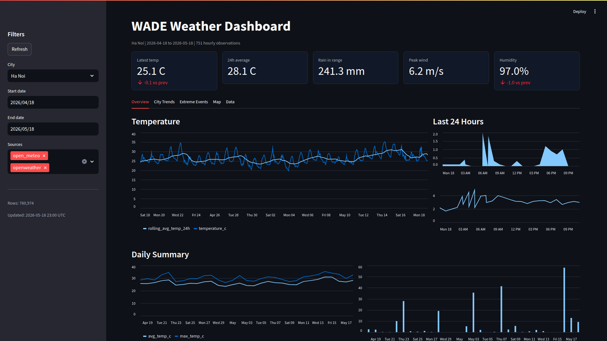

# WADE

Real-time Weather Anomaly Detection Engine for Vietnam weather data.

```text
External APIs -> Bronze Lake -> Silver Clean Tables -> Gold Analytical Tables -> Dashboard / ML
```

Docker mode stores bronze Parquet files in MinIO by default:

```text
External APIs -> MinIO bucket -> DuckDB/dbt -> Dashboard / ML
```

## DEMO



## Project Structure

```text
wade/
  configs/          Static configuration, city registry, DuckDB extension setup
  ingestion/        Python API collectors and Parquet writer
  lake/             Optional local runtime data lake partitions
  dbt_wade/         DuckDB + dbt transformation project
  orchestration/    Dagster assets and jobs
  dashboard/        Streamlit dashboard
  ml/               Isolation Forest training and scoring scripts
  data/             Runtime DuckDB database and scored anomaly outputs
  models/           Runtime ML model artifacts
```

## Data Layers

- `s3://wade-lake/bronze/weather/source=.../year=YYYY/month=MM/day=DD/`: raw API payload in MinIO as partitioned Parquet, with `source` and `ingested_at`.
- `lake/bronze/weather/source=.../year=YYYY/month=MM/day=DD/`: optional local Parquet storage when `WADE_STORAGE_BACKEND=local`.
- `dbt_wade/models/silver/`: clean hourly weather observations, UTC timestamps, physical validity flags, and deduplication by `(city_id, timestamp_utc)`.
- `dbt_wade/models/gold/`: analytical outputs for dashboard and ML:
  - `gold_weather_feature_store`: hourly ML feature store with rolling weather baselines, lag and delta features, seasonal city/hour normal values, z-scores, cyclical time features, and source lineage.
  - `gold_extreme_events_daily`: daily count of sudden temperature jumps, high wind, and heavy rain.
  - `gold_monthly_climate_delta`: year-over-year monthly temperature and humidity deltas.

## Object Storage

WADE supports two bronze storage backends:

```env
WADE_STORAGE_BACKEND=minio
```

Uses MinIO/S3-compatible object storage. This is the default in Docker Compose. In Docker, services talk to MinIO through:

```env
MINIO_ENDPOINT=http://minio:9000
MINIO_BUCKET=wade-lake
```

From your host machine, MinIO is available at:

```text
MinIO API: http://localhost:9000
MinIO console: http://localhost:9001
```

```env
WADE_STORAGE_BACKEND=local
```

Uses the local `lake/` folder instead. This is useful for quick local scripts outside Docker.

The `createbuckets` Compose service creates the `wade-lake` bucket automatically. DuckDB/dbt loads the `httpfs` extension and reads bronze Parquet from MinIO when `WADE_STORAGE_BACKEND=minio`.

## Anomaly Detection

The anomaly model is an Isolation Forest trained on the `gold_weather_feature_store` table. Feature engineering is handled in dbt so the dashboard and ML code read from the same curated feature layer.

Current feature groups include:

- Current observations: temperature, humidity, pressure, wind speed, and rain.
- Rolling context: 24h temperature min/max/std/range, 24h rain totals, 24h humidity and pressure averages, and 7d temperature/wind baselines.
- Short-term movement: 1h and 2h temperature deltas, plus humidity, pressure, and wind deltas.
- Local seasonal context: city + month + hour averages and z-scores for temperature, humidity, pressure, wind, and rain.
- Calendar encoding: hour, day of week, month, weekend flag, and cyclical sine/cosine hour/month features.

Training uses median imputation, standard scaling, and a configurable anomaly rate:

```env
WADE_ANOMALY_CONTAMINATION=0.03
```

Model and scored anomaly outputs are runtime artifacts:

```text
models/isolation_forest.joblib
data/weather_anomalies.parquet
```

## Setup

```bash
cd wade
cp .env.example .env
python -m venv .venv
source .venv/bin/activate
pip install -r requirements.txt
```

Add `OPENWEATHER_API_KEY` to `.env` if you want current weather ingestion.

Optional settings:

```env
WADE_STORAGE_BACKEND=minio
WADE_BACKFILL_START_DATE=2025-01-01
WADE_ANOMALY_CONTAMINATION=0.03
```

`WADE_BACKFILL_START_DATE` controls the Open-Meteo historical backfill start date. Open-Meteo can return `429 Too Many Requests` when you run too many historical loads in the same day, so treat full backfills as occasional/manual runs.

## Run Locally

Backfill historical weather from Open-Meteo:

```bash
python -m ingestion.open_meteo_backfill --start-date 2024-01-01 --end-date 2024-01-31
```

Fetch current weather from OpenWeather:

```bash
python -m ingestion.openweather_current
```

Run dbt models:

```bash
cd dbt_wade
dbt run --profiles-dir .
```

Train and score the anomaly model:

```bash
python -m ml.train_isolation_forest
python -m ml.score_anomalies
```

Run orchestration and dashboard:

```bash
docker compose up --build
```

Dagster: <http://localhost:3000>

Dagster jobs:

- `weather_refresh_job`: scheduled hourly; fetches current OpenWeather data and runs dbt.
- `weather_backfill_job`: manual; runs the Open-Meteo historical backfill and then dbt.

Use `weather_backfill_job` for one-time historical loads. Keep the hourly schedule on `weather_refresh_job` so Open-Meteo is not called repeatedly for the full historical range.

Streamlit: <http://localhost:8501>

MinIO API: <http://localhost:9000>

MinIO console: <http://localhost:9001>
